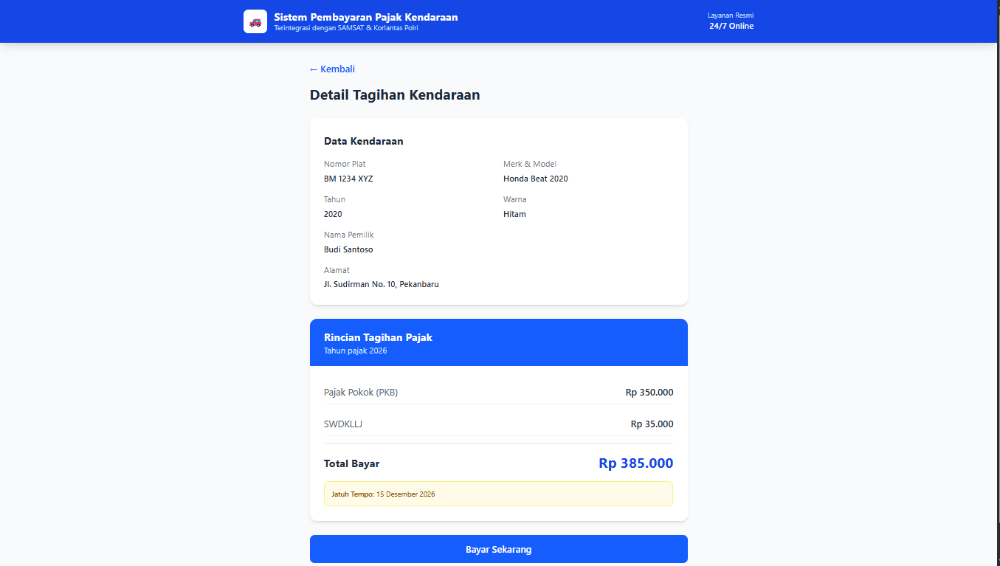
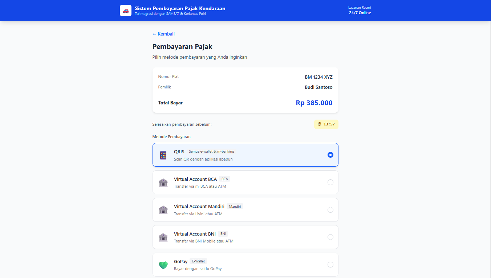
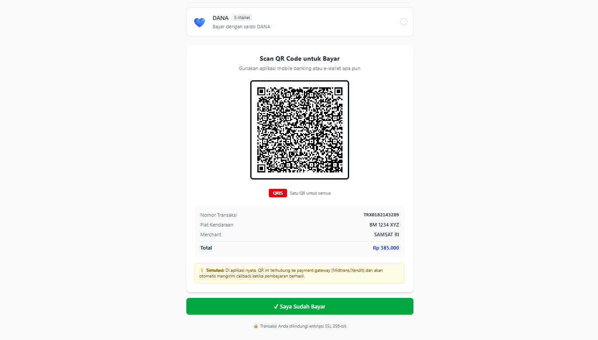
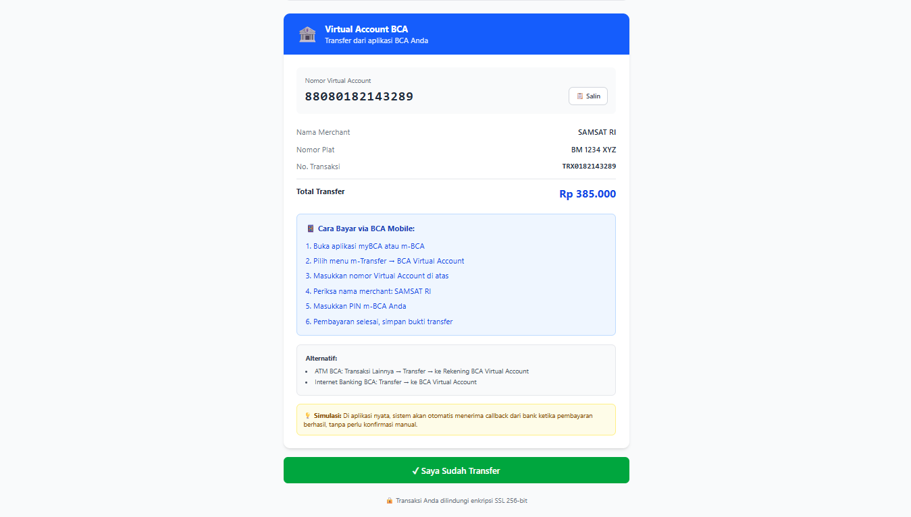
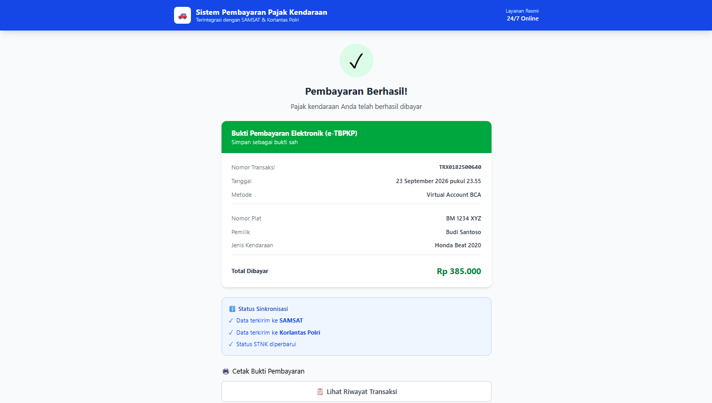
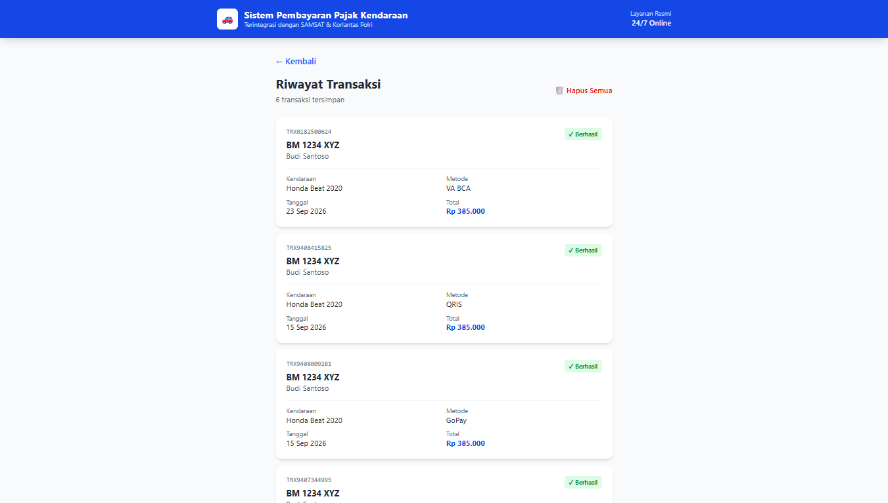

# 🚗 Vehicle Tax Payment System (VTPS)


> **Prototipe sistem pembayaran pajak kendaraan** yang lahir dari
> pengalaman pribadi menghadapi birokrasi pajak kendaraan antar-pulau
> di Indonesia.

---

## 📖 Latar Belakang (Personal Story)

Saya memiliki seorang adik perempuan yang sedang kuliah di **Pulau Jawa**,
sementara keluarga kami tinggal di **Pekanbaru, Sumatra**.

Setiap tahun, kami menghadapi masalah yang sama: **pajak kendaraan
milik adik saya hanya bisa dibayarkan di SAMSAT tempat kendaraan
tersebut terdaftar** — yaitu Pekanbaru. Padahal adik saya sedang
kuliah di Jawa.

**Masalah yang kami hadapi:**

| # | Masalah |
|---|---|
| 1 | Tidak bisa bayar di luar kota asal |
| 2 | Harus pemilik asli yang mengurus |
| 3 | Harus memanggil adik pulang dari Jawa |
| 4 | Persiapan dokumen memakan waktu |
| 5 | Kantor SAMSAT hanya buka hari kerja |
| 6 | Tidak ada visibilitas progres pembayaran |

**Suatu tahun, untuk membayar pajak kendaraan adik saya, saya mengalami:**
- 3 hari persiapan dokumen
- 2 kali kunjungan ke SAMSAT (kunjungan pertama ditolak)
- 8 jam waktu tunggu
- **Total: 2 minggu** untuk menyelesaikan satu pembayaran

**Proyek ini adalah jawaban saya untuk masalah tersebut.**

---

## 🎯 Solusi

Prototipe frontend yang menyimulasikan alur pembayaran pajak kendaraan
**terintegrasi** dengan SAMSAT, Korlantas Polri, dan Bapenda:

1. **Verifikasi kendaraan** — cukup input plat + STNK + nomor rangka
2. **Perhitungan otomatis** — PKB + SWDKLLJ + denda
3. **Pembayaran multi-channel** — QRIS, Virtual Account, E-Wallet
4. **Sinkronisasi real-time** — status ke SAMSAT & Polri
5. **Bukti pembayaran elektronik** — e-TBPKP siap cetak

---

## 📸 Screenshot

### 1. Halaman Input Data Kendaraan

*Form input plat nomor, STNK, dan nomor rangka mesin*

### 2. Detail Tagihan Pajak

*Rincian PKB, SWDKLLJ, denda, dan total yang harus dibayar*

### 3. Pilihan Metode Pembayaran

*Pilihan QRIS, Virtual Account (BCA/Mandiri/BNI), dan E-Wallet*

### 4. QR Code QRIS untuk Pembayaran

*QR code asli yang bisa di-scan dengan aplikasi e-wallet atau m-banking*

### 5. Virtual Account

*Nomor Virtual Account unik + instruksi pembayaran per bank*

### 6. Bukti Pembayaran (e-TBPKP)

*Bukti pembayaran elektronik siap cetak*

### 7. Riwayat Transaksi

*Daftar transaksi yang tersimpan (localStorage)*

---

## ✨ Fitur

- ✅ Verifikasi kendaraan (plat + STNK + rangka)
- ✅ Perhitungan pajak otomatis (PKB + SWDKLLJ + denda)
- ✅ **QRIS** dengan QR code asli (bisa di-scan)
- ✅ **Virtual Account** BCA, Mandiri, BNI
- ✅ **E-Wallet** GoPay, OVO, DANA
- ✅ Timer countdown 15 menit
- ✅ Riwayat transaksi persisten (localStorage)
- ✅ Print-ready e-TBPKP
- ✅ 3 bahasa dokumentasi (JP/EN/ID)

---

## 🛠️ Teknologi

| Layer | Teknologi |
|---|---|
| **Frontend** | React 19 + TypeScript |
| **Build** | Vite |
| **Styling** | Tailwind CSS 4 |
| **Routing** | React Router 7 |
| **State** | Context API |
| **Persistence** | localStorage |
| **QR Code** | qrcode.react |
| **Version Control** | Git + GitHub |

---

## 🚀 Cara Menjalankan

```bash
# Clone repo
git clone https://github.com/Nebukhad1/vehicle-tax-payment-system.git
cd vehicle-tax-payment-system/pajak-app

# Install dependencies
npm install

# Jalankan development server
npm run dev
```

Buka `http://localhost:5173/` di browser.

---

## 🧪 Data Uji Coba

| Plat | STNK | Rangka | Status |
|---|---|---|---|
| `BM 1234 XYZ` | `12345` | `67890` | Belum Lunas |
| `BM 5678 ABC` | `54321` | `09876` | Belum Lunas (denda) |
| `BM 9012 DEF` | `11111` | `22222` | Sudah Lunas |

---

## 📚 Dokumentasi Project Engineer

Proyek ini dilengkapi **dokumentasi lengkap** sebagai portofolio
**Project Engineer**:

| # | Deliverable | Status | Bahasa |
|---|---|---|---|
| 1 | **Project Charter** | ✅ | [🇯🇵 JP](./docs/charter/01-project-charter-jp.md) · [🇬🇧 EN](./docs/charter/01-project-charter-en.md) · [🇮🇩 ID](./docs/charter/01-project-charter-id.md) |
| 2 | **BPMN Diagram** | 🔄 | As-Is vs To-Be |
| 3 | **Arsitektur Sistem** | 🔄 | 5 layer |
| 4 | **API Contract** | 🔄 | Polri, Bapenda, Dukcapil |
| 5 | **SRS** | 🔄 | Software Requirements Spec |
| 6 | **Artikel** | 🔄 | LinkedIn / Medium |

---

## 🏗️ Arsitektur Sistem

```
┌─────────────────────────────────────────┐
│  LAYER 1: USER INTERFACE                │
│  React + TypeScript + Tailwind          │
├─────────────────────────────────────────┤
│  LAYER 2: AI RECOGNITION                │
│  OCR · Face Matching · Rule Engine      │
├─────────────────────────────────────────┤
│  LAYER 3: CORE INTEGRATION              │
│  Polri · Bapenda · Dukcapil             │
├─────────────────────────────────────────┤
│  LAYER 4: PAYMENT                       │
│  QRIS · VA · ATM · E-Wallet             │
├─────────────────────────────────────────┤
│  LAYER 5: WRITE-BACK & NOTIFICATION     │
│  Sinkronisasi status · e-TBPKP          │
└─────────────────────────────────────────┘
```

---

## 📌 Roadmap

- [x] Prototype frontend (5 halaman)
- [x] Multi-channel payment (QRIS, VA, E-wallet)
- [x] Riwayat transaksi (localStorage)
- [x] Print-ready e-TBPKP
- [x] Project Charter (JP/EN/ID)
- [ ] BPMN Diagram
- [ ] Arsitektur Diagram
- [ ] API Contract
- [ ] SRS Document
- [ ] Deploy ke Vercel
- [ ] Integrasi backend API

---

## ⚠️ Disclaimer

Proyek ini adalah **simulasi** untuk keperluan portofolio.
**Tidak menggunakan data asli.** Segala data kendaraan bersifat
dummy. Sesuai dengan **UU PDP No. 27/2022** tentang Perlindungan
Data Pribadi.

---

## 👤 Author

**Muhammad Nebukhadnezar Manthoufani**

- 📧 mhdnebukhadnezarmanthoufani@gmail.com
- 💼 [LinkedIn](https://linkedin.com/in/nebukhadnezar)
- 🐙 [GitHub](https://github.com/Nebukhad1)
- 📍 Pekanbaru, Indonesia

---

## 📄 Lisensi

MIT License — bebas digunakan untuk pembelajaran.

---

## 🙏 Ucapan Terima Kasih

Proyek ini didedikasikan untuk **adik saya** dan semua keluarga
Indonesia yang pernah mengalami kesulitan birokrasi pajak kendaraan.

Semoga proyek ini menjadi langkah kecil menuju transformasi
digital Indonesia yang lebih baik. 🇮🇩
