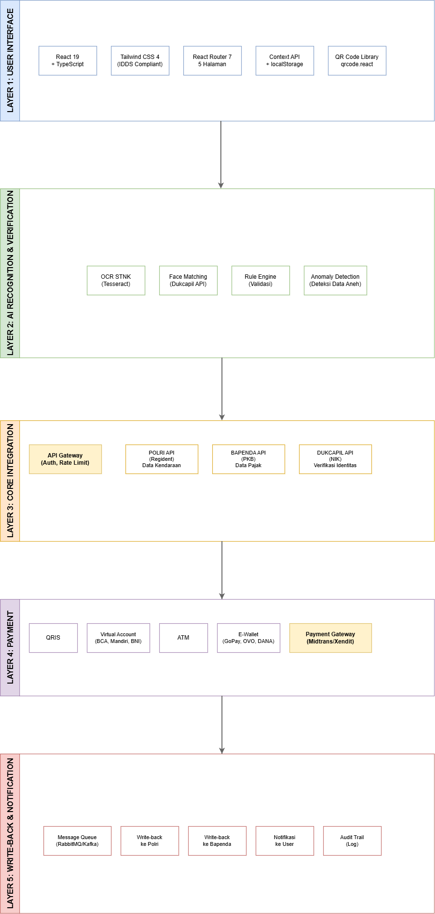

# System Architecture

Arsitektur sistem Vehicle Tax Payment System (VTPS).

## 5-Layer Architecture

## Layer Breakdown

### Layer 1: User Interface
- React 19 + TypeScript
- Tailwind CSS 4 (IDDS compliant)
- React Router 7 (5 halaman)
- Context API + localStorage
- qrcode.react

### Layer 2: AI Recognition & Verification
- OCR STNK (Tesseract)
- Face Matching (Dukcapil API)
- Rule Engine (Validasi input)
- Anomaly Detection

### Layer 3: Core Integration
- API Gateway (Auth, Rate Limit)
- Polri API (Data Kendaraan)
- Bapenda API (Data Pajak)
- Dukcapil API (Verifikasi Identitas)

### Layer 4: Payment
- QRIS
- Virtual Account (BCA, Mandiri, BNI)
- ATM
- E-Wallet (GoPay, OVO, DANA)
- Payment Gateway (Midtrans/Xendit)

### Layer 5: Write-Back & Notification
- Message Queue (RabbitMQ/Kafka)
- Write-back ke Polri
- Write-back ke Bapenda
- Notifikasi ke User
- Audit Trail

## Alur Data
User → Layer 1 → Layer 2 → Layer 3 → Layer 4 → Layer 5
↓
[Payment Gateway]
↓
[Write-Back to APIs]

text

## Teknologi

| Layer | Teknologi |
|---|---|
| 1 | React, TypeScript, Tailwind, Vite |
| 2 | Tesseract, Dukcapil API |
| 3 | REST API, Adapter Pattern |
| 4 | Midtrans/Xendit, QRIS |
| 5 | RabbitMQ, Webhook |

## Kepatuhan

- ✅ UU PDP No. 27/2022 (Perlindungan Data Pribadi)
- ✅ Perpres 95/2018 (SPBE)
- ✅ Standar QRIS EMVCo
