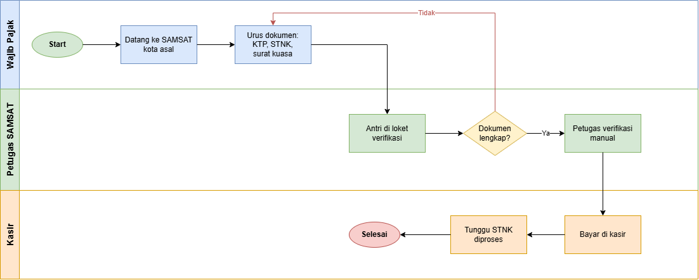
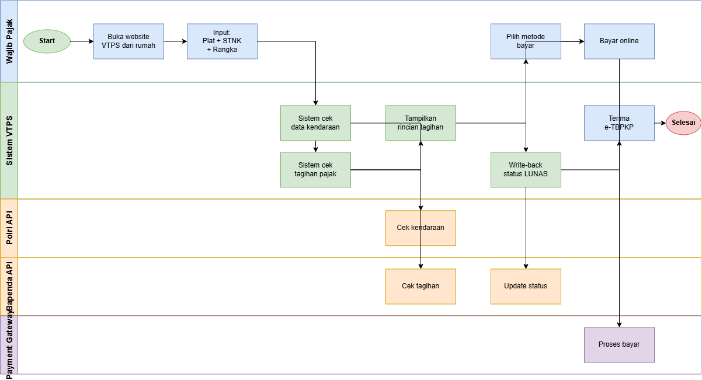

# BPMN Diagram

Business Process Model and Notation (BPMN) untuk Vehicle Tax Payment System.

## As-Is Process (Cara Lama)

Proses pembayaran pajak tradisional yang masih manual.

**Karakteristik:**
- Harus datang ke SAMSAT kota asal
- Urus dokumen manual (KTP, STNK, surat kuasa)
- Antri di loket
- Verifikasi manual oleh petugas
- Bayar di kasir
- Waktu: ~2 minggu

## To-Be Process (Cara Baru dengan VTPS)

Proses pembayaran pajak dengan sistem VTPS yang terintegrasi.

**Karakteristik:**
- Bayar dari rumah via website
- Input plat + STNK + rangka (3 field)
- Verifikasi otomatis via API Polri
- Perhitungan pajak otomatis via API Bapenda
- Pembayaran multi-channel (QRIS/VA/E-wallet)
- Write-back status real-time
- e-TBPKP instan
- Waktu: ~5 menit

## Perbandingan As-Is vs To-Be

| Aspek | As-Is | To-Be |
|---|---|---|
| **Lokasi** | Harus datang ke SAMSAT | Dari rumah |
| **Waktu** | ~2 minggu | ~5 menit |
| **Dokumen** | Manual (KTP, STNK, surat kuasa) | Digital (plat + STNK + rangka) |
| **Verifikasi** | Manual oleh petugas | Otomatis via API |
| **Pembayaran** | Kasir | QRIS, VA, E-wallet |
| **Status update** | Manual | Real-time write-back |
| **Bukti bayar** | Fisik (TBPKP) | Digital (e-TBPKP) |
| **Stakeholder** | 3 pihak | 5 pihak (terintegrasi) |

## Referensi

- [BPMN 2.0 Specification](https://www.omg.org/spec/BPMN/2.0/)
- Tools: [draw.io](https://app.diagrams.net)
